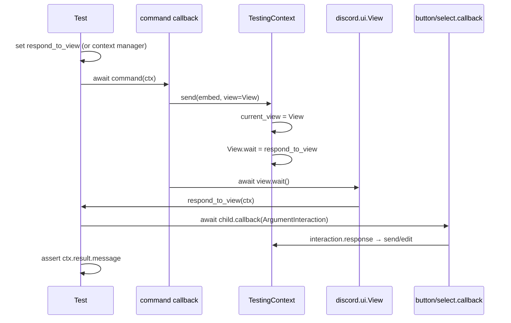
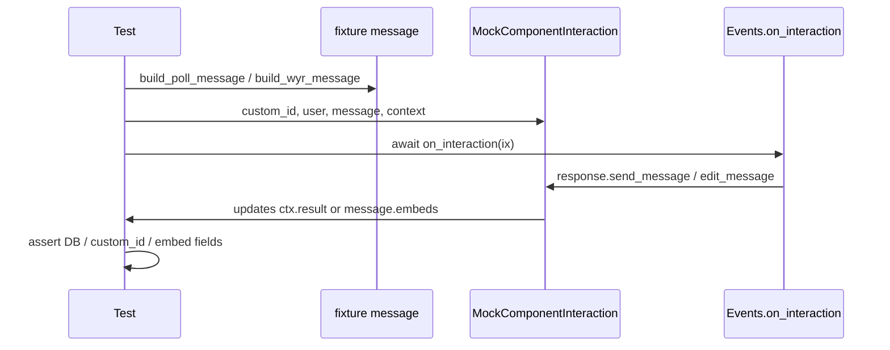

# Killua test system

Integration tests run offline via `python -m killua -t` (see [COVERAGE_AUDIT.md](COVERAGE_AUDIT.md) for scope, gaps, and the **70%** coverage gate). CI uses **Python 3.13** ([`.github/workflows/python-tests.yml`](../../.github/workflows/python-tests.yml)).

# Explanation of how testing works with Killua

Index

[The design of the testing system](#design)

[How tests are written](#how-tests-are-written)

[Testing Views and component interactions](#testing-views-and-component-interactions)

[Coverage audit and games DM notes](#coverage-audit-and-games-dm-notes)

[Troubleshooting](#troubleshooting)

## Design
### The mock classes

In general, testing a command works by controlling everything *but* the command callback itself. That means of all relevant discord objects there exists a class in `killua/tests/types`, mocking their methods and attributes that are used inside of the commands. Their `__class__` is set to the discord class they mock to avoid an `isinstance(argument, discordClass)` inside of a command falsely failing on a mock class.

There also exist mock classes for pymongo database stuff in [`killua/utils/test_db.py`](../utils/test_db.py). When `-t` / `--test` is passed, the `DB` class switches to in-memory `TestingDatabase` instead of MongoDB. Each test **command class** run clears that store and `User.cache` before executing (see `reset_test_fixtures` in [`fixtures.py`](fixtures.py), called from `Testing.test_command`).

### How responses can be verified

All mock classes of messagables (`Member`, `TextChannel`, `Context`...) have an overwritten `send` method that, instead of actually sending it somewhere, creates a mock message of how a message object would *look like* if sent, then sets this as the attribute `result` of the supplied `Context` object to the command. 

This is why all messagables that *aren't* `Context` have a property referring back to it so they are able to set that attribute.

### How `View`s and `Bot.wait_for` is handled

Both `View` and `Bot.wait_for` normally require another user interaction for the command functioning normally. For `View` it also strongly depends on what the user does on what the commands response is. They are handled by:

+ `Bot.wait_for`
For this, `asyncio.wait` is used with **`asyncio.create_task`** (required since Python 3.13) to run the command and a method of `Bot` that resolves the `wait_for` at the same time.
```py
await asyncio.wait({
    asyncio.create_task(command(context)),
    asyncio.create_task(Bot.resolve("message", MockMessage())),
})
```

+ `View`s
When a command `await ctx.send(..., view=some_view)`, `TestingContext.send` stores the view on `context.current_view` and replaces `view.wait` with `context.respond_to_view`. After the command body returns, your test callback runs **in the same coroutine** (no real 15-minute Discord timeout). See [Testing Views and component interactions](#testing-views-and-component-interactions) for Path A vs Path B and full examples.

### UML Diagram of Testing structure


In Essence one big class, `Testing` is subclassed first for each Cog, then that subclass for the cog is subclassed for each command.

This way, commands can be dynamically found from methods defined in the base class and `__subclassess__()`. After many months of playing around with this this seems like the cleanest and most effective layout to me.

### Logging

The system uses the `logging` module instead of printing results. Set level with `-l` / `--log` (default `INFO`), e.g. `python -m killua -t -l DEBUG`.

For local debugging, use `logging.debug(...)` or prefix prints with a logging level if you rely on structured log output. A stderr filter (`DevMod`) that hid non-log lines exists in [`tests/__init__.py`](__init__.py) but is **disabled**; assertion tracebacks are controlled via `SUPPRESS_TEST_TRACEBACKS` when using `--json`.

### Assertion checks

All checks are written using the `assert` keyword. This way it is easier to identify where exactly a check has failed and what the actual result is. This is *insanely* useful from my testing. For example, a failed test output will look like this:


Thanks to writing it like `assert actual == "Expected", actual` when catching the error `str(error)` will output the value of `actual` removing the necessity of having to debug it further (or if you are like me slapping print statements everywhere)

## How tests are written

### The layout
As explained in the [design](#design) section, an actual test is within a subclass of a subclass of `Testing`. So to test a command `hello` of Cog `Group` this layout would be used:

```py
from ...cogs.group  import  Group # Importing the original cog

from ..types  import * # Importing all mock classes
from ..testing  import  Testing, test # Import base class and decorator

class  TestingGroup(Testing):
    def  __init__(self):
        super().__init__(cog=Group)

class Hello(TestingGroup):
    def __init__(self):
        super().__init__()
        self.command = self.cog.hello # This is not required, handy for more dynamic subclasses
```

### Writing a test

Now that everything is layed out, you just need to write tests. These are methods on the command class they are tests for decorated with `@test` (as imported previously). These tests call the command function directly with a mock context accessible though `self.base_context` and any other necessary commands. 

After that, the context object will contain whatever was sent back by the command. So you can then check wether this is what you expected or not with pythons `assert` statement like this:

```py
# This is inside the Hello class
@test
async def should_work(self):
    await self.command(self.base_context)

    assert self.base_context.result.message.content == "hello", self.base_context.result.message.content
    # It is important to place whatever variable to test again after the comma so if it fails, 
    # the actual value of that variable can be displayed in the logs 
```
For writing tests including `Views` or `Bot.wait_for`, see [How `View`s and `Bot.wait_for` is handled](#how-views-and-botwait_for-is-handled) and [Testing Views and component interactions](#testing-views-and-component-interactions).

### Testing Views and component interactions

Killua uses Discord UI in two different ways. Tests mirror that split instead of stubbing “the user clicked something.”

| Production pattern | Who handles the click | Test path | Interaction type |
|--------------------|----------------------|-----------|-------------------|
| Command sends a `discord.ui.View` and `await view.wait()` | Button/Select **callbacks** on that view | **Path A** | `ArgumentInteraction` |
| Persistent listener on the cog (`on_interaction`) | `Events.on_interaction` (poll/WYR votes, etc.) | **Path B** | `MockComponentInteraction` |
| Command sends a view in a **DM** (`Member.send`) | Same as Path A, but `wait` is triggered from patched `send` | **Path A (DM)** | `ArgumentInteraction` via `member_dm` |

Both paths funnel replies into the same place: `context.result.message` (content, embeds, components), so assertions stay identical to non-interactive commands.

#### End-to-end flow (Path A — command-owned view)

Typical case: `cards use` confirm (1026), defense select, paginator, `actions settings` select.



**Minimal example** (settings save button):

```py
from ..types import ArgumentInteraction
from ..harnesses import find_button, respond_to_view

async def press_save(ctx):
    btn = find_button(ctx.current_view, custom_id="save")
    await btn.callback(ArgumentInteraction(ctx))

with respond_to_view(self.base_context, press_save):
    await self.command(self.cog, self.base_context)

assert "saved" in self.base_context.result.message.content
```

**Confirm / cancel** — reuse `Testing.press_confirm` / `press_cancel` as the `respond_to_view` callback (`cards_use_spells.py`, shop buy):

```py
from ..harnesses import respond_to_view

self.base_context.timeout_view = False  # True → instant on_timeout (1026 timeout test)
with respond_to_view(self.base_context, Testing.press_confirm):
    await invoke_use(self, 1026)
```

**Paginator** — do not hand-roll `custom_id` strings; use `press_paginator_button` so the real `Buttons` callback runs:

```py
from ..harnesses import embed_footer_page, press_paginator_button

await self.command(self.cog, self.base_context, ...)
view = self.base_context.current_view
msg = self.base_context.result.message
before = embed_footer_page(msg.embeds[0])
await press_paginator_button(
    view, "next", context=self.base_context, message=msg
)
after = embed_footer_page(self.base_context.result.message.embeds[0])
assert after[0] == before[0] + 1
```

**Defense select** (attack flow waits on target’s view) — `spell_use.respond_defense_with_spell` finds the `Select` and passes `data={"values": [str(spell_id)]}`:

```py
from ..harnesses import respond_defense_with_spell, run_attack_against_defender

# run_attack_against_defender sets respond_to_view to respond_defense_with_spell internally
await run_attack_against_defender(self, defense_id=1003, use_defense=True)
```

Helpers: `harnesses/views.py` (`find_button`, `find_select`), `harnesses/context.py` (`respond_to_view` context manager restores the previous callback).

#### End-to-end flow (Path B — cog `on_interaction`)

Poll and WYR votes are **not** wired through `view.wait()` on the command that created the message. `Events.on_interaction` reads `interaction.data["custom_id"]`, edits the embed, and may write `guild.polls`. Tests build a **message-shaped fixture** (embed + fake component rows) and call the listener directly.



**Example** (sixth voter → encrypted option `custom_id`; see `events.py` + `poll_wyr.py`):

```py
from ..harnesses import (
    build_poll_message,
    cast_vote,
    encrypted_tail_on_button,
    option_button_custom_id,
)

msg = build_poll_message(
    self.base_author.id,
    option_index=1,
    visible_voter_ids=[v1, v2, v3, v4, v5],  # 5 names in embed → next vote encrypts
)
cid_before = option_button_custom_id(msg, option_index=1)
ix = await cast_vote(
    self.cog,
    context=self.base_context,
    message=msg,
    voter=DiscordMember(id=new_voter_id, guild=self.base_guild),
    custom_id=cid_before,
)
assert ix.response.is_done()
# After vote, re-read button custom_id from updated message components
tail = encrypted_tail_on_button(updated_cid, "poll:opt-1:")
assert len(tail) > 0
```

`MockComponentInteraction` (`harnesses/interaction.py`) implements enough of `discord.Interaction` for listeners: `type`, `data`, `user`, `message`, `response.send_message` / `edit_message`, `followup`, and `original_response`. It is **not** used for Path A view callbacks — those use `ArgumentInteraction` in `types/interaction.py`, which ties `response.send_message` back to `context.send` and keeps `current_view` in sync.

#### Path A in DMs (`member_dm`)

RPS PvP/PvE: the command does not attach `respond_to_view` on the guild context for the DM select. Instead, `patch_member_rps_select` wraps `Member.send`, builds a `Message`, and replaces `view.wait` so `RpsSelect.callback(ArgumentInteraction(...))` runs with a chosen `data["values"]`. Do **not** stub `_wait_for_dm_response` if you want this wiring tested (see `games.py`).

#### Stubs vs real callbacks

Use **stubs** (`patch`, `AsyncMock`) for boundaries: HTTP, `random.choice`, `asyncio.sleep`, huge `channel.history`. Use **Path A/B** when the test subject is UI wiring (wrong `custom_id`, double `response`, select values, timeout). Stubbing `_wait_for_defense` or `_wait_for_dm_response` only checks downstream logic, not that the right component fired.

#### Paginator / help caveats

Some paginator subclasses (`HelpPaginator`, `ShopPaginator`, …) delete the message and re-invoke the command when `start()` finishes. For **pagination-only** tests, temporarily replace `Subclass.start` with `killua.utils.paginator.Paginator.start` so the test stops after `view.wait()` without follow-up navigation. For `get_group_help` / `get_formatted_commands`, the test bot may not register every production command; you can `patch.object(bot, "walk_commands", return_value=[...])` with minimal command-like objects (real `callback.__code__` for `find_source`) to exercise embed and footer formatting.

## Line coverage (`coverage.py`)

Runtime line coverage for almost all of `killua/` (see [`.coveragerc`](../../.coveragerc)). Install once: `pip install -r requirements-dev.txt`. **Gate:** `fail_under = 70` on the statement-weighted total.

```bash
coverage run -m killua -t              # full suite
coverage report                        # fails if total < 70%
coverage run -m killua -t games        # one cog group
coverage html                          # open htmlcov/index.html
```

See [COVERAGE_AUDIT.md](COVERAGE_AUDIT.md) for scope, gaps, and command-scenario notes.

## Coverage audit and games DM notes

- **Living matrix**: [COVERAGE_AUDIT.md](COVERAGE_AUDIT.md) lists games / cards / todo / economy / moderation coverage and **exit criteria** for high-value commands.
- **Games — DM flows**: use [`harnesses.member_dm.patch_member_rps_select`](harnesses/member_dm.py) on `Member.send` so `_wait_for_dm_response` completes via real `RpsSelect` callbacks (see `games.py` PvP/PvE tests). Do not stub `_wait_for_dm_response`.
- **Cards spell `use`**: import from [`harnesses`](harnesses/) — `invoke_use`, `assert_steal_succeeded`, `setup_met_view_spell`, `respond_to_view`, etc. See `groups/cards_use_spells.py`.
- **Poll / WYR votes**: use [`harnesses/poll_wyr.py`](harnesses/poll_wyr.py) to build messages with 5+ embed voters and assert encrypted `custom_id` tails or premium `guild.polls` updates via `Events.on_interaction`.
- **DM confirms** (e.g. todo invite): [`harnesses/dm_view.patch_user_confirm_dm`](harnesses/dm_view.py).

## Troubleshooting

### `Views` and interactions
When a view or listener test misbehaves, see [Testing Views and component interactions](#testing-views-and-component-interactions) first. Quick checks:
+ **Path A**: Is `timeout_view` accidentally `True`? Is `respond_to_view` set *before* `await command(...)` (or inside the `respond_to_view` context manager)?
+ **Path A**: Are you calling `ArgumentInteraction` on a **view child** callback, not `MockComponentInteraction`?
+ **Path B**: Does the fixture `message` have `components` / `embeds` the listener expects? Does `custom_id` match production (`poll:opt-1:`, `wyr:opt-b:`, …)?
+ **Path B**: Did the listener call `interaction.response`? Assert `ix.response.is_done()` after `on_interaction`.

### An issue with `User`

Make sure the `User` database entry is exactly how you want it to be before the command. Resetting the database can often cause more harm than good!